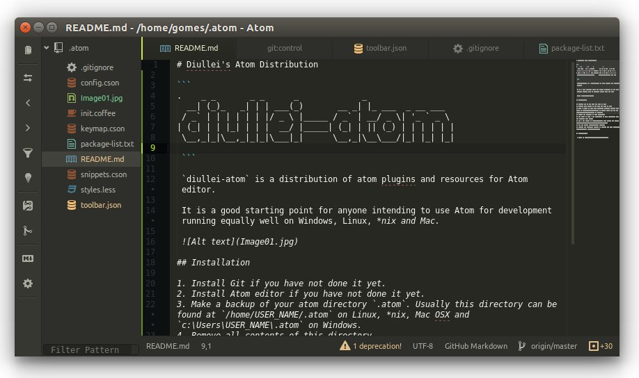

# Diullei's Atom Distribution


```
.    _ _       _ _      _             _
  __| (_)_   _| | | ___(_)       __ _| |_ ___  _ __ ___  
 / _` | | | | | | |/ _ \ |_____ / _` | __/ _ \| '_ ` _ \
| (_| | | |_| | | |  __/ |_____| (_| | || (_) | | | | | |
 \__,_|_|\__,_|_|_|\___|_|      \__,_|\__\___/|_| |_| |_|

 ```

 `diullei-atom` is a distribution of atom plugins and resources for Atom editor.

 It is a good starting point for anyone intending to use Atom for development running equally well on Windows, Linux, *nix and Mac.

 

## Installation

### Linux, *nix, Mac OSX Installation

The easiest way to install `diullei-atom` is to use an automatic script installer by simply copying and pasting the following line into a terminal.

```shell
curl https://raw.githubusercontent.com/Diullei/diullei-atom/master/diullei-atom-bootstrap.sh -L > diullei-atom-bootstrap.sh && sh diullei-atom-bootstrap.sh
```
> This will install `diullei-atom` and backup your existing atom configuration

### Manual installation

1. Install Git if you haven't done it yet.
2. Install Atom editor if you haven't done it yet.
3. Make a backup of your atom directory `.atom`. Usually this directory can be found at `/home/USER_NAME/.atom` on Linux, *nix, Mac OSX and `c:\Users\USER_NAME\.atom` on Windows.
4. Remove all contents of this directory.
5. Use `git` to start a git repository at this directory. Goto `.atom` directory and execute: `git init`.
6. Add a git remote to `diullei-atom`: `git remote add origin https://github.com/diullei/diullei-atom.git`.
7. Get the latest `diullei-atom` content.
8. Execute the following command to install all arom packages: `apm install --packages-file package-list.txt`.
